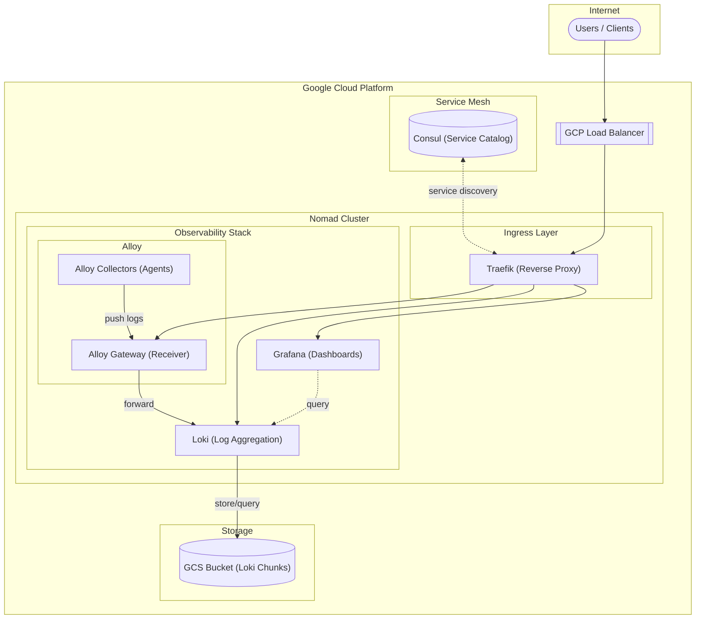

# Nomad Sentinel Policy Module

Terraform module for deploying Nomad Sentinel policies that enforce artifact security. This module provides two layers of protection:

1. **Artifact Source Validation** - Restricts artifact downloads to approved URL prefixes
2. **Checksum-Based Binary Authorization** - Ensures artifacts have approved checksums for integrity verification

The module also creates a GCS bucket for storing approved artifacts with proper IAM controls.

## Features

- **Artifact Source Validation** - Enforces that all job artifacts come from approved URL prefixes
- **Binary Authorization via Checksums** - Validates artifact checksums against an approved manifest
- **GCS Artifact Storage** - Creates a secure GCS bucket for storing approved artifacts
- **Protected Checksums Manifest** - Stores approved checksums in GCS with IAM-controlled access
- **Hard-Mandatory Enforcement** - Jobs with unapproved artifacts or checksums are rejected at submission
- **Flexible Configuration** - Configurable prefixes, checksums, and enforcement levels
- **Comprehensive Test Jobs** - Includes example Nomad jobs for testing all policy behaviors

## Architecture

### Job Submission Flow

```
┌─────────────────────────────────────────────────────────────────────────────────┐
│                              Job Submission Flow                                 │
├─────────────────────────────────────────────────────────────────────────────────┤
│                                                                                 │
│   ┌──────────────┐                                                              │
│   │  Nomad Job   │                                                              │
│   │  Submission  │                                                              │
│   └──────┬───────┘                                                              │
│          │                                                                      │
│          ▼                                                                      │
│   ┌─────────────────────────────────────────────────────────────────────────┐   │
│   │                      Sentinel Policy Evaluation                         │   │
│   ├─────────────────────────────────────────────────────────────────────────┤   │
│   │                                                                         │   │
│   │   ┌─────────────────────────┐     ┌─────────────────────────────────┐   │   │
│   │   │  restrict-artifact-     │     │  artifact-checksum-             │   │   │
│   │   │  sources                │     │  authorization                  │   │   │
│   │   │                         │     │                                 │   │   │
│   │   │  • Check URL prefixes   │     │  • Verify checksum present     │   │   │
│   │   │  • Allow approved       │     │  • Validate checksum format    │   │   │
│   │   │    sources only         │     │  • Check against approved list │   │   │
│   │   └───────────┬─────────────┘     └────────────────┬────────────────┘   │   │
│   │               │                                    │                    │   │
│   │               └──────────────┬─────────────────────┘                    │   │
│   │                              │                                          │   │
│   └──────────────────────────────┼──────────────────────────────────────────┘   │
│                                  │                                              │
│                       ┌──────────┴──────────┐                                   │
│                       │                     │                                   │
│                  ┌────▼────┐          ┌─────▼────┐                              │
│                  │  PASS   │          │   FAIL   │                              │
│                  │         │          │          │                              │
│                  └────┬────┘          └──────────┘                              │
│                       │                                                         │
│                       ▼                                                         │
│               ┌─────────────┐                                                   │
│               │   Nomad     │                                                   │
│               │  Scheduler  │                                                   │
│               └──────┬──────┘                                                   │
│                      │                                                          │
│                      ▼                                                          │
│   ┌─────────────────────────────────────────────────────────────────────────┐   │
│   │                        GCS Artifact Bucket                              │   │
│   ├─────────────────────────────────────────────────────────────────────────┤   │
│   │  gcs::https://www.googleapis.com/storage/v1/{project}-nomad-artifacts/  │   │
│   │                                                                         │   │
│   │  ├── security/                                                          │   │
│   │  │   └── approved-checksums.json  (protected manifest)                  │   │
│   │  ├── scripts/                                                           │   │
│   │  │   └── approved-script.sh       (sha256:35ec6141...)                  │   │
│   │  ├── configs/                                                           │   │
│   │  │   └── config.json              (sha256:a0d066fc...)                  │   │
│   │  └── app/                                                               │   │
│   │      └── config.yaml              (sha256:8b1c0a9c...)                  │   │
│   └─────────────────────────────────────────────────────────────────────────┘   │
│                                                                                 │
└─────────────────────────────────────────────────────────────────────────────────┘
```

### Binary Authorization Flow

```
┌──────────────┐     ┌──────────────┐     ┌──────────────┐     ┌──────────────┐
│   CI/CD      │────▶│   Build      │────▶│  Calculate   │────▶│   Update     │
│   Pipeline   │     │   Artifact   │     │   SHA256     │     │   Manifest   │
└──────────────┘     └──────────────┘     └──────────────┘     └──────────────┘
                                                                      │
                                                                      ▼
┌──────────────┐     ┌──────────────┐     ┌──────────────┐     ┌──────────────┐
│   Job        │────▶│   Sentinel   │────▶│   Validate   │────▶│   Allow/     │
│   Submission │     │   Policy     │     │   Checksum   │     │   Deny       │
└──────────────┘     └──────────────┘     └──────────────┘     └──────────────┘
```

## Usage

### Basic Example

```hcl
module "sentinel_policy" {
  source = "../../modules/nomad-sentinel-policy"

  # Required
  project_id    = "my-gcp-project"
  nomad_address = "http://nomad.example.com:4646"

  # Grant Nomad clients access to artifacts bucket
  artifact_reader_members = [
    "serviceAccount:nomad-client-sa@my-gcp-project.iam.gserviceaccount.com"
  ]
}
```

### With Binary Authorization

```hcl
module "sentinel_policy" {
  source = "../../modules/nomad-sentinel-policy"

  project_id    = "my-gcp-project"
  nomad_address = "http://nomad.example.com:4646"
  region        = "us-central1"

  # Artifact source restrictions
  artifact_reader_members = [
    "serviceAccount:nomad-client-sa@my-gcp-project.iam.gserviceaccount.com"
  ]

  # Binary authorization settings
  require_artifact_checksum         = true
  checksum_policy_enforcement_level = "hard-mandatory"

  # IAM for checksum manifest management
  checksums_admin_members = [
    "serviceAccount:ci-cd@my-gcp-project.iam.gserviceaccount.com"
  ]

  # Add checksums from CI/CD pipeline
  additional_approved_checksums = {
    "releases/v2.0/app.tar.gz" = {
      checksum    = "sha256:abcd1234..."
      description = "Application release v2.0"
      added_by    = "ci-pipeline"
      added_at    = "2026-01-24"
    }
  }
}
```

### Custom Allowed Prefixes

```hcl
module "sentinel_policy" {
  source = "../../modules/nomad-sentinel-policy"

  project_id    = "my-gcp-project"
  nomad_address = "http://nomad.example.com:4646"

  # Add additional allowed artifact sources
  allowed_artifact_prefixes = [
    "gcs::https://www.googleapis.com/storage/v1/my-gcp-project-nomad-artifacts/",
    "gcs::https://www.googleapis.com/storage/v1/shared-artifacts-bucket/",
  ]
}
```

## Requirements

| Name | Version |
|------|---------|
| terraform | >= 1.5.0 |
| google | >= 5.0.0 |
| nomad | >= 2.0.0 |

## Providers

| Name | Version |
|------|---------|
| google | >= 5.0.0 |
| nomad | >= 2.0.0 |

## Inputs

| Name | Description | Type | Default | Required |
|------|-------------|------|---------|:--------:|
| project_id | GCP project ID | `string` | n/a | yes |
| nomad_address | Nomad cluster API address | `string` | n/a | yes |
| region | GCP region for the artifacts bucket | `string` | `"us-central1"` | no |
| allowed_artifact_prefixes | List of allowed artifact source prefixes. Defaults to GCS bucket URL. | `list(string)` | `null` | no |
| artifact_reader_members | IAM members with read access to artifacts bucket (e.g., Nomad client service accounts) | `list(string)` | `[]` | no |
| require_artifact_checksum | If true, all artifacts MUST have a checksum. If false, checksums are validated only when present. | `bool` | `true` | no |
| checksum_policy_enforcement_level | Enforcement level: `soft-mandatory`, `hard-mandatory`, or `advisory` | `string` | `"hard-mandatory"` | no |
| checksums_admin_members | IAM members allowed to modify the approved checksums manifest | `list(string)` | `[]` | no |
| additional_approved_checksums | Additional approved checksums beyond those managed by this module | `map(object)` | `{}` | no |

## Outputs

| Name | Description |
|------|-------------|
| artifact_bucket_url_prefix | The GCS bucket URL prefix for allowed artifacts |
| artifact_bucket_name | The name of the GCS artifacts bucket |
| approved_checksums | Map of all approved artifact checksums |
| approved_checksums_manifest_url | URL of the approved checksums manifest file in GCS |
| checksum_policy_name | Name of the checksum authorization Sentinel policy |

## Sentinel Policies

### Policy 1: restrict-artifact-sources

Validates that artifact download URLs come from approved sources.

**Enforcement**: `hard-mandatory`
**Scope**: `submit-job`

**Logic**:
1. Iterates all task groups and tasks in the submitted job
2. Allows jobs with no artifacts
3. Validates each artifact source starts with an allowed prefix
4. Rejects on first violation

### Policy 2: artifact-checksum-authorization

Validates that artifacts have approved checksums for binary authorization.

**Enforcement**: Configurable (`hard-mandatory` default)
**Scope**: `submit-job`

**Logic**:
1. Checks if checksum is present (required by default)
2. Validates checksum format (`sha256:<64 hex chars>`)
3. Validates checksum against approved list
4. Provides detailed denial messages

### Example Policy Evaluation

```
Job: production-app
  Task Group: web
    Task: server
      Artifact: gcs://bucket/app.tar.gz
        Source: PASS (matches allowed prefix)
        Checksum: sha256:a0d066fc... → PASS (in approved list)

    Task: sidecar
      Artifact: https://untrusted.com/file.sh
        Source: FAIL (no matching prefix)

Overall Result: REJECTED
```

## Test Jobs

The module includes comprehensive test jobs for validating both policies:

### Source Validation Tests

| File | Description | Expected Result |
|------|-------------|-----------------|
| `approved-artifact.nomad` | Artifact from approved GCS bucket | PASS |
| `execute-artifact.nomad` | Downloads and executes script from GCS | PASS |
| `no-artifacts.nomad` | Job with no artifact stanzas | PASS |
| `unapproved-artifact.nomad` | Artifact from untrusted URL | FAIL |
| `mixed-artifacts.nomad` | Both approved and unapproved artifacts | FAIL |

### Checksum Authorization Tests

| File | Description | Expected Result |
|------|-------------|-----------------|
| `checksum-approved.nomad` | Artifact with approved checksum | PASS |
| `checksum-multi-artifact.nomad` | Multiple artifacts, all approved | PASS |
| `checksum-unapproved.nomad` | Artifact with unapproved checksum | FAIL |
| `checksum-missing.nomad` | Artifact without checksum | FAIL |
| `checksum-invalid-format.nomad` | Malformed checksum | FAIL |

### Running Tests

```bash
# Source validation tests
nomad job run approved-artifact.nomad      # Should succeed
nomad job run unapproved-artifact.nomad    # Should fail

# Checksum authorization tests
nomad job run checksum-approved.nomad      # Should succeed
nomad job run checksum-unapproved.nomad    # Should fail
nomad job run checksum-missing.nomad       # Should fail
```

## Artifacts

### Pre-uploaded Artifacts

| Path | Checksum | Description |
|------|----------|-------------|
| `scripts/approved-script.sh` | `sha256:35ec6141...` | Executable shell script |
| `configs/config.json` | `sha256:a0d066fc...` | JSON configuration |
| `app/config.yaml` | `sha256:8b1c0a9c...` | YAML configuration |

### Checksums Manifest

The approved checksums are stored in `security/approved-checksums.json`:

```json
{
  "version": "1.0",
  "description": "Approved artifact checksums for Nomad binary authorization",
  "updated_at": "2026-01-23T21:29:48Z",
  "checksums": {
    "configs/config.json": {
      "checksum": "sha256:a0d066fcf615c2093468be2428d3a940f57e2a225dc6a540d93ec26d32b4afb5",
      "description": "Application configuration file",
      "added_by": "terraform",
      "added_at": "2026-01-23"
    }
  }
}
```

### Adding Custom Artifacts

1. Add the artifact file to `artifacts/` directory
2. Calculate its SHA256 checksum:
   ```bash
   shasum -a 256 artifacts/my-artifact.tar.gz
   ```
3. Add to Terraform configuration:

```hcl
# In gcs.tf
resource "google_storage_bucket_object" "my_artifact" {
  name         = "path/to/my-artifact.tar.gz"
  bucket       = google_storage_bucket.nomad_artifacts.name
  source       = "${path.module}/artifacts/my-artifact.tar.gz"
  content_type = "application/gzip"
}

# In module call or checksums.tf locals
additional_approved_checksums = {
  "path/to/my-artifact.tar.gz" = {
    checksum    = "sha256:<calculated-checksum>"
    description = "My custom artifact"
    added_by    = "terraform"
    added_at    = "2026-01-24"
  }
}
```

## CI/CD Integration

### Automated Checksum Management

```yaml
# Example Cloud Build configuration
steps:
  # Build artifact
  - name: 'gcr.io/cloud-builders/docker'
    entrypoint: 'sh'
    args:
      - '-c'
      - |
        tar -czf app.tar.gz ./app
        CHECKSUM="sha256:$(sha256sum app.tar.gz | cut -d' ' -f1)"
        echo "$CHECKSUM" > /workspace/checksum.txt

  # Upload to GCS
  - name: 'gcr.io/cloud-builders/gsutil'
    args: ['cp', 'app.tar.gz', 'gs://${PROJECT_ID}-nomad-artifacts/releases/']

  # Update checksums via Terraform
  - name: 'hashicorp/terraform'
    args:
      - 'apply'
      - '-auto-approve'
      - '-var=additional_approved_checksums={"releases/app.tar.gz":{"checksum":"'$(cat /workspace/checksum.txt)'","description":"Release build","added_by":"cloud-build","added_at":"'$(date +%Y-%m-%d)'"}}'
```

## Security Considerations

### Binary Authorization Guarantees

| Aspect | Guaranteed | Notes |
|--------|------------|-------|
| Integrity verification | ✅ Yes | SHA256 ensures content hasn't changed |
| Source restriction | ✅ Yes | Only approved URL prefixes allowed |
| Tamper detection | ✅ Yes | Modified artifacts fail checksum |
| Identity proof | ❌ No | Doesn't prove who built the artifact |

### Production Recommendations

1. **Protect the checksums manifest** - Only CI/CD service accounts should have write access
2. **Use hard-mandatory enforcement** - Prevents override of policy
3. **Enable GCS bucket versioning** - Already enabled by default
4. **Audit checksum changes** - Enable Cloud Audit Logs on the GCS bucket
5. **Rotate checksums** - Remove old checksums when artifacts are deprecated
6. **Use service account authentication** - Never use public bucket access in production

### IAM Best Practices

```hcl
# Only CI/CD can modify checksums
checksums_admin_members = [
  "serviceAccount:ci-cd@project.iam.gserviceaccount.com"
]

# Nomad clients can only read artifacts
artifact_reader_members = [
  "serviceAccount:nomad-sa@project.iam.gserviceaccount.com"
]
```

## Troubleshooting

### Check Policy Status

```bash
# List all sentinel policies
nomad sentinel list

# Read policy details
nomad sentinel read restrict-artifact-sources
nomad sentinel read artifact-checksum-authorization
```

### View Policy Violations

When a job is rejected, Nomad displays detailed messages:

```
Error submitting job: Unexpected response code: 500 (1 error occurred:
    * artifact-checksum-authorization : Result: false

    DENIED: Task server - artifact gcs://bucket/app.tar.gz has unapproved checksum: sha256:0000...
      This checksum is not in the approved checksums manifest
      Contact your CI/CD team to add this artifact to the approved list
)
```

### Verify Checksums Manifest

```bash
# View the manifest
gsutil cat gs://<project>-nomad-artifacts/security/approved-checksums.json | jq .

# List approved checksums
gsutil cat gs://<project>-nomad-artifacts/security/approved-checksums.json | jq '.checksums | keys'
```

### Calculate Artifact Checksum

```bash
# Local file
shasum -a 256 my-artifact.tar.gz

# Remote file in GCS
gsutil cat gs://bucket/artifact.tar.gz | shasum -a 256
```

### Test Policy Without Submitting

```bash
# Plan shows policy evaluation
nomad job plan my-job.nomad
```

## Resources Created

### GCP Resources

- GCS Bucket (`{project_id}-nomad-artifacts`)
- Bucket IAM bindings for artifact readers
- Bucket IAM bindings for checksums admins (conditional)
- Storage objects for artifacts
- Storage object for checksums manifest

### Nomad Resources

- Sentinel Policy: `restrict-artifact-sources`
- Sentinel Policy: `artifact-checksum-authorization`

## Observability Stack Integration

This module integrates with the Nomad-Consul scenario's observability stack for monitoring artifact downloads and policy violations.

### Architecture Overview



### Observability Components

| Component | Role | Description |
|-----------|------|-------------|
| **Traefik** | Reverse Proxy | Routes external traffic to internal services |
| **Grafana** | Visualization | Dashboard and log exploration interface |
| **Loki** | Log Aggregation | Stores and indexes log data in GCS |
| **Alloy Collectors** | Log Collection | Discovers and tails Nomad allocation logs |
| **Alloy Gateway** | Log Forwarding | Receives logs from collectors, forwards to Loki |

### Collector Pipeline

```
┌─────────────────────────────────────────────────────────────────────────────┐
│ Each Nomad Node (system job)                                                │
│                                                                             │
│  ┌──────────────────────────────────────────────────────────────────────┐   │
│  │ alloy-collector                                                      │   │
│  │                                                                      │   │
│  │  ┌──────────────────┐     ┌─────────────────────┐                    │   │
│  │  │ discovery.nomad  │────►│ discovery.relabel   │                    │   │
│  │  │ (service disco)  │     │ (stdout + stderr)   │                    │   │
│  │  └──────────────────┘     │                     │                    │   │
│  │                           │ Labels:             │                    │   │
│  │                           │ • job               │                    │   │
│  │                           │ • namespace         │                    │   │
│  │                           │ • task_group        │──┐                 │   │
│  │                           │ • task              │  │                 │   │
│  │                           │ • alloc_id          │  │                 │   │
│  │                           │ • stream            │  │                 │   │
│  │                           └─────────────────────┘  │                 │   │
│  │                                                    ▼                 │   │
│  │  ┌──────────────────┐     ┌─────────────────────────────────┐        │   │
│  │  │ local.file_match │────►│ loki.source.file                │        │   │
│  │  │ (fallback glob)  │     │         │                       │        │   │
│  │  └──────────────────┘     │         ▼                       │        │   │
│  │                           │ loki.process (add node label)   │        │   │
│  │                           │         │                       │        │   │
│  │  ┌──────────────────┐     │         ▼                       │        │   │
│  │  │ local.file_match │────►│ loki.write.gateway ─────────────┼────────┼──►│
│  │  │ (system logs)    │     └─────────────────────────────────┘        │   │
│  │  └──────────────────┘                                                │   │
│  └──────────────────────────────────────────────────────────────────────┘   │
└─────────────────────────────────────────────────────────────────────────────┘
                                                                              │
                                                                              ▼
                                                              ┌───────────────────────┐
                                                              │       Gateway         │
                                                              │  loki.source.api      │
                                                              │        │              │
                                                              │        ▼              │
                                                              │  loki.write ──────────┼──► Loki
                                                              └───────────────────────┘
```

### Querying Logs

Access Grafana and use LogQL to query logs:

```logql
# All logs from a specific job
{job="my-nomad-job"}

# Logs from a specific task
{job="my-nomad-job", task="web"}

# Filter by log content
{job="my-nomad-job"} |= "error"

# Logs from a specific allocation
{alloc_id="abc123"}

# Artifact download errors
{job="my-job"} |= "artifact" |= "failed"
```

### Testing the Observability Stack

#### Submit Test Payload

```bash
curl -X POST \
  -H "Content-Type: application/json" \
  "http://gateway-api.<traefik-domain>:8080/loki/api/v1/push" \
  -d '{
    "streams": [{
      "stream": { "job": "test", "source": "curl" },
      "values": [[ "'$(date +%s)000000000'", "Test log message" ]]
    }]
  }'
```

#### Query Test Payload

```bash
curl -G \
  --data-urlencode 'query={job="test", source="curl"}' \
  "http://loki.<traefik-domain>:8080/loki/api/v1/query"
```

### Troubleshooting Observability

#### Logs Not Appearing

```bash
# Check Alloy collector
nomad job status alloy-collector
nomad alloc logs <collector-alloc-id>

# Check Alloy gateway
nomad job status alloy-gateway
curl -v http://gateway-api.<traefik-domain>:8080/ready

# Check Loki
nomad alloc logs <loki-alloc-id>
```

#### Force Flush to GCS

```bash
curl -X POST "http://loki.<traefik-domain>:8080/flush"
```

## References

- [Nomad Sentinel Policies](https://developer.hashicorp.com/nomad/docs/enterprise/sentinel)
- [Sentinel Language](https://docs.hashicorp.com/sentinel/language)
- [Nomad Artifact Stanza](https://developer.hashicorp.com/nomad/docs/job-specification/artifact)
- [GCS IAM Conditions](https://cloud.google.com/storage/docs/access-control/using-iam-permissions)
- [Grafana Loki Documentation](https://grafana.com/docs/loki/latest/)
- [Grafana Alloy Documentation](https://grafana.com/docs/alloy/latest/)
- [LogQL Query Language](https://grafana.com/docs/loki/latest/query/)

## License

This module is part of the terraform-gcp-nomad project. See the main project LICENSE for details.
